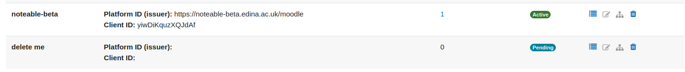

# LTI Course Template

This is a Moodle plugin that is based on the original Moodle plugin "Publish as LTI tool".
The changes allow automatic course creation (from a template course) through the LTI connection.

This plugin version supports LTI Advantage (LTI 1.3) 

## Install (should be automatic with the install script)
1. copy the litcoursetemplate dir into moodle/enrol/
2. install plugin in Moodle (site administration/notifications)

NOTE: the plugin requires a user ID that is capable to run course backup/restore.
   It is set to the ID of the user that installs the plugin but can be changed in the plugin settings.

# Configure moodle to be a Tool Provider, using Template Courses

This plugin will accept LTI 1.1 and 1.3 connections.

Note that LTI 1.1 is depreciated by 1EdTech

**Moodles internal LTI authentication gives _different_ usernames when using _different_ versions of LTI connection. This tool inherits that failing.**

This plugin will connect to the same course [with different LTI connectors] if the same identifer is used for both connections.

- The LTI 1.3 "Custom Parameter" `platform` <=> the LTI 1.1 `key` 

# Connecting using an LTI 1.3 connection

Connecting via LTI 1.3 is a multi-step process

## Step 0 - Ensure the plugins are enabled

Go to `Site administration` -> `Plugins` -> `Authentication` -> `Manage authentication` and ensure `LTI` is _Enabled_

Go to `Site administration` -> `Plugins` -> `Enrolments` -> `Manage enrol plugins` and ensure `Publish as LTI Course Template tool` is _Enabled_ (and `Publish as LTI tool` is _Disabled_)

## Step 1 - Register the platform

The Platform, in this instance, refers to a running service, so
- 3 different moodles at the same organisation are 3 different platforms,
- BlackBoard Ultra is 1 platform
- Canvas & Moodle Workplace are currently assumed to appear as different platforms 

Go to `Site administration` -> `Plugins` -> `Enrolments` -> `Tool registration`

(here - `noteable-beta` has been registered, `delete me` has not. )

- If the platform is already registered skip to [step 3 - register the customers deployment](#step-3-register-the-customers-deployment)
- If the platform has not been registered: Click on `Register a platform`, give it a sensible name, and you'll be shown the _Registration_ details

### If the platform has _NOT_ been registered

**Send the Registration details to the customer**

- Send the customer the Registration details:
    - **Registration URL** eg https://foo.edu/moodle/enrol/lticoursetemplate/register.php?token=abc123def
    - **Tool URL** eg https://foo.edu/moodle/enrol/lticoursetemplate/launch.php
    - **Initiate login URL** eg https://foo.edu/moodle/enrol/lticoursetemplate/login.php?id=abc123def
    - **JWKS URL** eg https://foo.edu/moodle/enrol/lticoursetemplate/jwks.php
    - **Deep linking URL** eg https://foo.edu/moodle/enrol/lticoursetemplate/launch_deeplink.php

You may also want to send them a URL to the `icon` for your service.

- If they are BlackBoard Ultra, they will only send back a `Deployment ID`
- If they use the `Registration URL`, this will configure their "Platform" _and_ auto-configure the appropriate details back to StackEd. (This may be a "Moodle-specific" thing)
- If they configure manually, they will send _back_ details akin to:
    - `Platform ID`: https://example.com/ultra
    - `Client ID`: 123456AbCd789X
    - `Deployment ID`: 6
    - `Public keyset URL`: https://example.com/ultra/mod/lti/certs.php
    - `Access token URL`: https://example.com/ultra/mod/lti/token.php
    - `Authentication request URL`: https://example.com/ultra/mod/lti/auth.php

Note than the URLs are pointing to their platform.

### Configure the Platform Registration

This assumes you've been sent details akin to:
- `Platform ID`: https://example.com/ultra
- `Client ID`: 123456AbCd789X
- `Deployment ID`: 6
- `Public keyset URL`: https://example.com/ultra/mod/lti/certs.php
- `Access token URL`: https://example.com/ultra/mod/lti/token.php
- `Authentication request URL`: https://example.com/ultra/mod/lti/auth.php

and that `Site administration` -> `Plugins` -> `Enrolments` -> `Tool registration` does _not_ show `Details`
- Click on the `pen-on-paper` icon ()
    - Click on `Edit platform details`
    - Fill in the details given
    - Click on `save changes`
    - Continue with Step 3

## Step 3 - Register the Customer's deployment

Go to `Site administration` -> `Plugins` -> `Enrolments` -> `Tool registration` and find the appropriate registered platform for the customer

There are two options at this point:

1. The platform may already have some deployments (eg `noteable-beta` above)
2. The platform has no current deployments (eg `delete me` above)

### Platform already has deployments

Click on the number in the **Deployments** column, and check if the `Deployment ID` from the customer is listed.

- If it is, job done, go to Step 4
- If not, you need to add it - use the `Add a deployment` button
    - Give it a sensible name
    - enter the `Deployment ID` from the customer
    - Click on `Save changes`

### Platform has no deployments

Click on the `hierarchy` icon ()

- use the `Add a deployment` button
    - Give it a sensible name
    - enter the `Deployment ID` from the customer
    - Click on `Save changes`

## Step 4 - Creating a template course for the customer

The plugin works by using a base course, and then, for each LTI connection from the VLE, creating a _new course_ using the _base course_ as a template

This new course will take the name of the course from the LTI connection.

### Create the base course

Go to `Site administration` -> `Courses` -> `Manages courses and categories`

- We suggest creating a new `category` using the name of the customer.... unless you are creating a new course for an existing customer
- Create a new `course`
  - The `full name` should be indicative of the customer
  - The `short name` should be short, use only the characters `a-zA-Z0-9-`
  - The `category` should be appropriate for the customer
  - Set `visibility` to `hide` 
  - Remove the tick enabling `end date`
  - Click on `Save and return`
- Click on the `cog` icon for the template course
  - Under the `More` tab, select `Publish as LTI Course Template tools`
  - Ensure your using the `LTI Advantage` tab
  - Click `Add` to create a new connection
    - Set the name to something sensible
    - change **Teacher first launch provisioning mode** to be `New accounts only (automatic)` [this stops remote `Admin`s connecting to your `Admin` account!]
    - Under `User default values` (some fields are hidden under `Show more...`) you may want to set `City/town` and `Country`, and maybe set `Institution` to the customer's name
    - Click `Add method`
  - **Note the `Custom properties` entry** (`id=abc-123-etc`)
  
#### You may wish to pre-fill the template with course-work:

You can _restore_ a moodle backup course (.mbz) file to the course, which will then appear is all subsequent courses using this template.

`Site administration` -> `Courses` -> `Restore course`
    Standard Moodle backup process, and it can be put into any category (miscellaneous is fine).  

### Send the customer the **TWO** required Custom Parameters

The LTI Course Template Tool requires 2 custom parameters from the customer's connection: an `id` to identify the course to use as the template; and `platform` to seed the short-code for the created course

- `id` is the value from the `Custom properties` above
- `platform` should be a _short_ code for the customer - it is used to seed the short code for courses created from the template.
  - If the connection is to match an LTI 1.1 connection, this value needs to be identical to the LTI 1.1 `key`

The customer needs to add these to their Tool Configuration.
 
## Step 5 - Test!

Get the customer to test the connection works

# Connecting using an LTI 1.1 connection

## Step 0 - Ensure the plugins are enabled

Go to `Site administration` -> `Plugins` -> `Authentication` -> `Manage authentication` and ensure `LTI` is _Enabled_

Go to `Site administration` -> `Plugins` -> `Enrolments` -> `Manage enrol plugins` and ensure `Publish as LTI Course Template tool` is _Enabled_ (and `Publish as LTI tool` is _Disabled_)

## Step 1 - Creating a template course for the customer

The plugin works by using a base course, and then, for each LTI connection from the VLE, creating a _new course_ using the _base course_ as a template

This new course will take the name of the course from the LTI connection.

### Create the base course

Go to `Site administration` -> `Courses` -> `Manages courses and categories`

- We suggest creating a new `category` using the name of the customer.... unless you are creating a new course for an existing customer
- Create a new `course`
  - The `full name` should be indicative of the customer
  - The `short name` should be short, use only the characters `a-zA-Z0-9-`
  - The `category` should be appropriate for the customer
  - Set `visibility` to `hide` 
  - Remove the tick enabling `end date`
  - Click on `Save and return`
- Click on the `cog` icon for the template course
  - Under the `More` tab, select `Publish as LTI Course Template tools`
  - Click on the `Legacy LTI (1.1/2.0)` tab
  - Click `Add` to create a new connection
    - Set the name to something sensible
    - Under `User default values` (some fields are hidden under `Show more...`) you may want to set `City/town` and `Country`, and maybe set `Institution` to the customer's name
    - Click `Add method`
  - **Note the `Launch URL` and `Secret` entries**

## Step 2 - Send the customer the configuration details for their VLE

They need three items:

- `Launch URL` - This is the URL used to connect to moodle system, and includes an `id` parameter specific to this connection.
- `Secret` - the value from above.
- `key` - This is not defined by the plugin, however is the seed for new Course Codes.
  - If the connection is to match an LTI 1.3 connection, this value needs to be identical to the LTI 1.3 Custom Parameter `platform`

## Step 3 - Test!

---

# LTI 1.3 PROVIDER configuration

Notes on manually configuring an External Tool when using this plugin

**Tool Settings**
- **Tool URL** == _Tool URL_
- **Plublic key type** == `Keyset URL`
- **Public keyset** == _JWKS URL_
- **Initiate login** == _Initialte login URL_
- **Redirection URI(s)** == _Tool URL_ & _Deep linking URL_
- **Custom parameters** == `id` and `platform`
- **Default launch container** == `New window`
- (`Supports Deep Linking (Content-Item Message)` checked)
- **Content Selection URL** == _Deep linking URL_

**Privacy**
- **Share launcher's name with tool** == `Always`
- **Share launcher's email with tool** == `Always`
  
---

**Set up Blackboard Learn as Tool Consumer:**

I. Method 1 - Register New Tool

   This method requires the TC administrator to set up Consumer Key and Secret for every tool set up in the TC.

1. Register new Basic LTI tool (System Admin->Basic LTI tools(Tools and Utilities) )
2. Registration Settings
   1. Provide name
   2. Set Launch URL from Tool Provider
   3. Set Consumer key - IMPORTANT, MUST BE SET and should not be changed after the link has been used
   4. Set Shared secret form Tool Provider
   5. Set Outcomes - required by the tool
   6. Tick box next to “Create a grade column in advance of first use?”
   7. Tic box next to: Outcomes (LTI 1.1) [DISABLED], Tool Consumer Profile [DISABLED], Tool Settings [DISABLED]
   8. Leave anything else unchanged and click Submit
3. Data Settings
   
   **CONTEXT DATA**
   1. Tick Context ID box
   2. Select “Database key” as Value to use for context ID
   3. Tick SourcedId box
   4. Tick Context Title box
   
   **PERSONAL DATA**

   5. User Id - Required by tool
   6. Value to use for user ID - Database key
   7. SourcedId tick box
   8. User name - Required by tool
   9. Email - Required by tool
   10. User Avatar - optional
   11. User Roles - tick box
   12. Leave anything else unchanged and click Submit
   13. CONNECT TO TOOL OPTIONS - set up to whatever preferred
   
4. Add Basic LTI Tool “by Name” to a course

DONE

II. Method 2 - Register New Domain

   This method allows to set up the Moodle instance as a domain and define the Consumer key and Secret only once.

1. Registration Settings
   1.a. Domain name - your Moodle domain (i.e.: moodle.ed.ac.uk)

   The rest of the settings is the same as in the Method 1.

2. Add Basic LTI Tool to a course
   2.a. Select “By URL”
   2.b. Provide name
   2.c. Provide Launch URL form TP

DONE